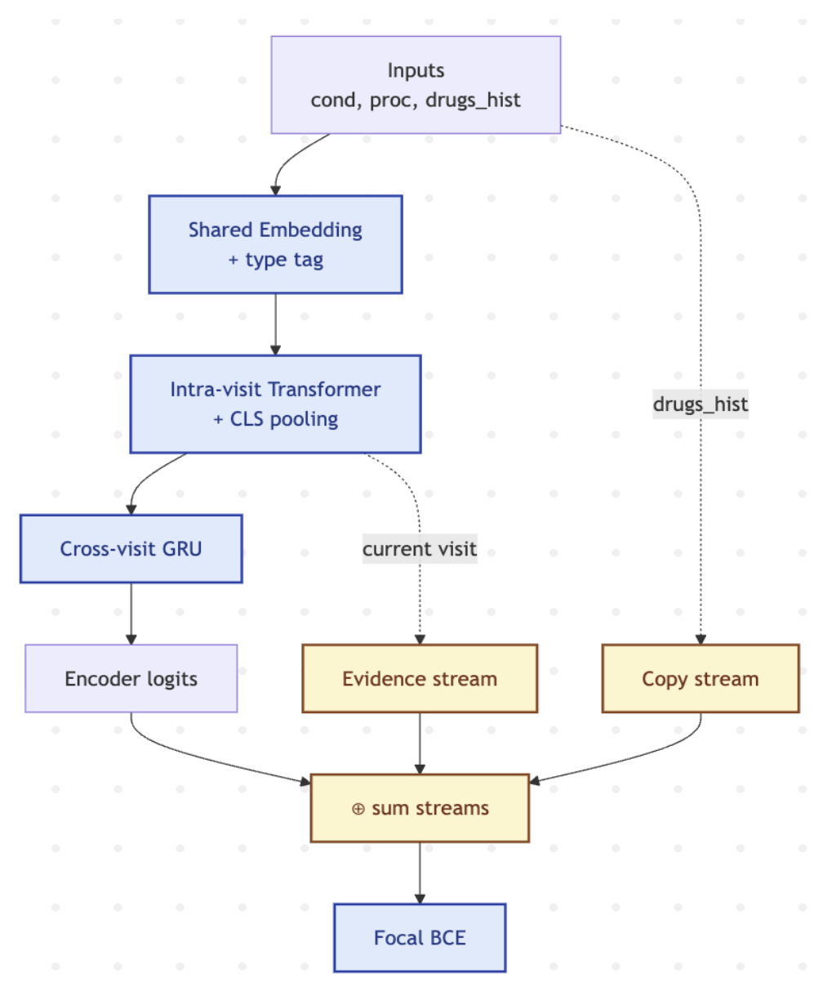
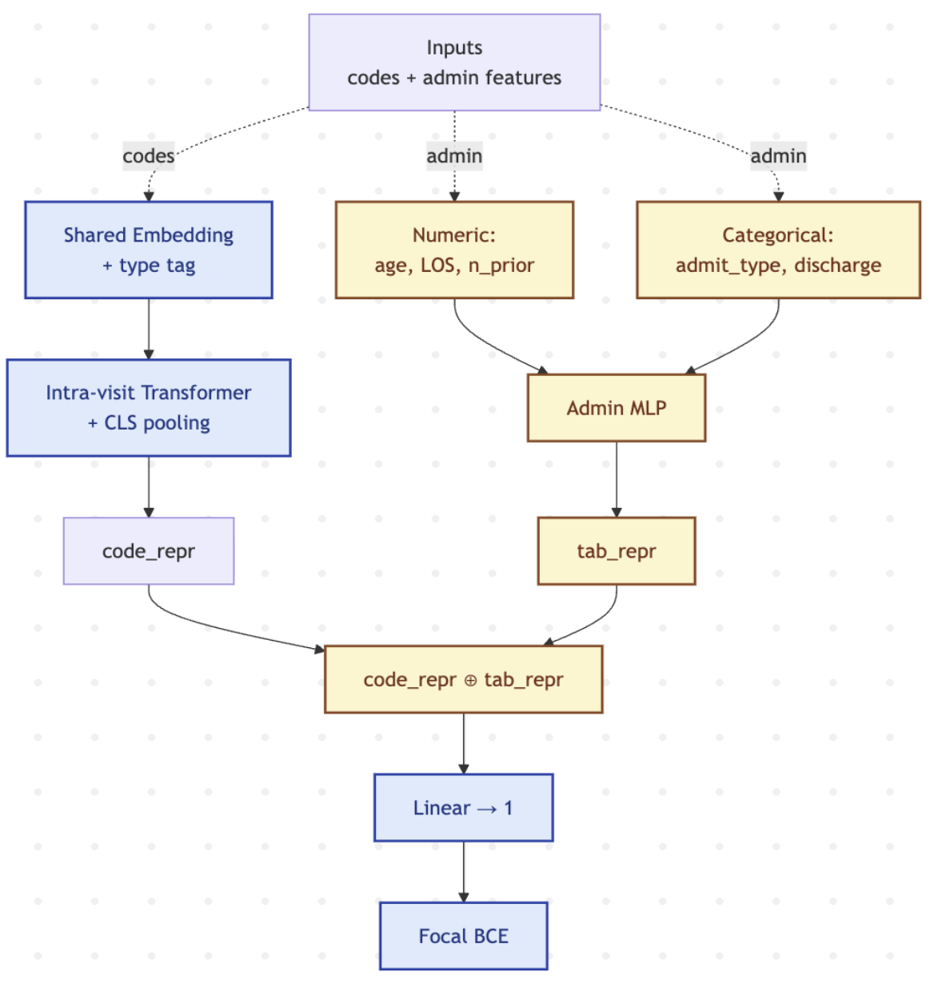

# MIMIC-III Healthcare Prediction — Three Tasks

A unified PyHealth-based pipeline for three prediction tasks on MIMIC-III:

1. **Drug recommendation** — multi-label, multi-visit
2. **Mortality prediction** — binary, single-visit
3. **Readmission prediction** — binary, single-visit

All three tasks share one trainer (`trainer.py`) and one dataset module
(`data/`). The drug-recommendation task uses a hierarchical attention model
with copy + evidence streams; the two binary tasks share a simpler
intra-visit transformer + structured-feature MLP architecture.

## Layout

```
.
├── README.md
├── requirements.txt
├── trainer.py            # unified entry point
├── data/
│   ├── admin_features.py # 5-feature admin lookup (age, los, n_prior, admit, disch)
│   ├── demographics.py   # age_bucket + admit_type lookup
│   └── tasks.py          # PyHealth task subclasses augmented with extra features
└── models/
    ├── losses.py         # focal_bce_loss
    ├── hcat_drugrec.py   # multi-visit, multi-label model
    └── hcat_binary.py    # single-visit, binary model (mortality + readmission)
```

## Setup

```bash
# Python 3.12 (other 3.10+ versions should work)
python -m venv venv
source venv/bin/activate
pip install -r requirements.txt
```

The MIMIC-III csv.gz dump is expected at `./physionet_data/` by default
(override with `--root /path/to/mimic3`). Required tables:
`PATIENTS.csv.gz`, `ADMISSIONS.csv.gz`, `DIAGNOSES_ICD.csv.gz`,
`PROCEDURES_ICD.csv.gz`, `PRESCRIPTIONS.csv.gz`.

## Running

All three tasks use the same entry point. Run from the project root:

```bash
# Drug recommendation
python trainer.py --task drug_rec    --variant ABC  --epochs 30
python trainer.py --task drug_rec    --variant AB   --epochs 30
python trainer.py --task drug_rec    --variant A    --epochs 30
python trainer.py --task drug_rec    --variant baseline --epochs 30

# Mortality prediction
python trainer.py --task mortality   --variant full     --epochs 20
python trainer.py --task mortality   --variant no_admin --epochs 20
python trainer.py --task mortality   --variant no_codes --epochs 20
python trainer.py --task mortality   --variant baseline --epochs 20

# Readmission prediction
python trainer.py --task readmission --variant full     --epochs 20
python trainer.py --task readmission --variant no_admin --epochs 20
python trainer.py --task readmission --variant no_codes --epochs 20
python trainer.py --task readmission --variant baseline --epochs 20
```

For a quick smoke test, add `--dev` (uses a tiny subset of MIMIC-III) and
`--no_wandb` (skips Weights & Biases logging):

```bash
python trainer.py --task mortality --variant full --epochs 1 --dev --no_wandb
```

## Variants

### Drug recommendation



| Variant   | Model             | Notes                                            |
|-----------|-------------------|--------------------------------------------------|
| `baseline`| PyHealth `Transformer` | Vanilla baseline + BCE                      |
| `A`       | `HCATDrugRec`     | Hierarchical encoder (intra-visit attn + GRU), BCE |
| `AB`      | `HCATDrugRec`     | A + focal BCE                                    |
| `ABC`     | `HCATDrugRec`     | AB + copy stream + evidence stream (full model)  |

### Mortality / Readmission



| Variant    | Model         | Notes                                          |
|------------|---------------|------------------------------------------------|
| `baseline` | PyHealth `RNN`| Vanilla baseline                               |
| `full`     | `HCATBinary`  | Intra-visit transformer + admin-feature MLP    |
| `no_admin` | `HCATBinary`  | Codes only (transformer path)                  |
| `no_codes` | `HCATBinary`  | Admin features only (MLP path)                 |

The `full` variant for the binary tasks also requires `--use_focal` if you
want focal BCE; vanilla BCE is the default.

## CLI flags

```
--task {drug_rec,mortality,readmission}    required
--variant <name>                            required (see tables above)
--root PATH                                 MIMIC-III root, default ./physionet_data
--epochs N
--patience N            early-stop patience (default: 10 for drug_rec HCAT, off otherwise)
--batch_size N          default: 32 (baseline / binary), 24 (drug_rec HCAT)
--lr 1e-3
--wd FLOAT              default: 0.0 (drug_rec), 1e-4 (binary)
--seed 42
--embedding_dim 128
--dropout 0.3
--focal_gamma 2.0
--use_focal             binary tasks only — switch from BCE to focal BCE
--exp_name STR          default auto-generated
--output PATH           default ./results/<task>/
--dev                   tiny subset for smoke testing
--no_wandb              disable Weights & Biases logging
--wandb_project NAME    default per task
```

## Outputs

Each run writes:

```
results/<task>/<exp_name>/
├── trajectory.csv        per-epoch train/val metrics (when wandb is on)
├── test_metrics.json     final test scores
├── args.json             full hyperparameter set
├── model_info.json       model class + parameter count
└── pyhealth/             PyHealth Trainer's checkpoints + log.txt
```

A master CSV at `results/<task>/all_runs_test_metrics.csv` gets
one appended row per run, with the variant, hyperparameters, and all test
metrics.

## Reproducibility

- Patient-level 80/10/10 split (PyHealth's `split_by_patient`)
- Seed via PyHealth's `set_seed`, defaulting to `42` — override with `--seed N` for sweeps
- Best checkpoint by validation `roc_auc` (binary) or `pr_auc_samples` (drug rec)
